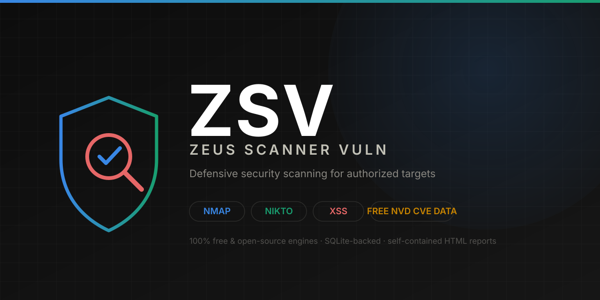
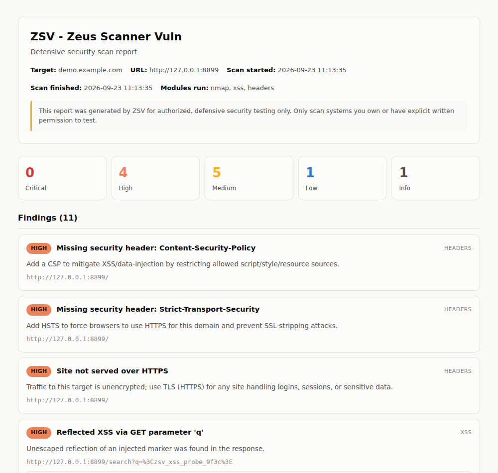

<p align="center">
  
</p>

<p align="center">
  <a href="https://github.com/HossamDB/ZSV-Zeus-Scanner-Vuln/actions/workflows/tests.yml"></a>
  <a href="LICENSE"></a>
  
  
  
</p>

# ZSV -- Zeus Scanner Vuln

**A free, open-source defensive security scanner: port/service discovery,
web vulnerability checks, reflected-XSS detection, and CVE matching --
rolled into one SQLite-backed HTML report.**

ZSV exists for one reason: security teams and developers need a scanner
they can point at their own infrastructure, get a clear report from, and
build on -- without a commercial license, a sales call, or a seat limit.
Every engine it integrates (Nmap, Nikto) is free and open source, and the
CVE data comes from NIST's public NVD API at no cost.

> **Only scan systems you own or have explicit written authorization to
> test.** See [Legal / authorization notice](#legal--authorization-notice) below.

---

## Why ZSV

| | |
|---|---|
| **No license, no seat limit** | Every scan engine ZSV drives is free and open source. No "Essentials" tier, no IP cap, no sales call. |
| **One report, every finding** | Nmap, Nikto, XSS, headers/TLS, and matched CVEs all land in the same SQLite database and the same HTML report -- not four separate tool outputs to reconcile by hand. |
| **A real, queryable CVE database** | Every scan updates a local `cves` table via the free NVD API, cached and keyed by service/version -- `sqlite3 ~/.zsv/zsv.db` gets you a running CVE history, not a one-off PDF. |
| **Built to be extended** | Every scanner module is a plain function returning dataclasses -- adding a new check (SQLi, subdomain enum, an OpenVAS bridge) means writing one module, not touching the core. |
| **Safe by construction** | The XSS module only ever sends inert marker strings to the single host you name. ZSV refuses to run at all without an explicit `--authorized` flag. |

## What it checks

- **Nmap** -- port/service discovery with version detection (shells out to
  the system `nmap` binary; XML output parsed with the standard library).
- **Nikto** *(opt-in, `--nikto`)* -- free, open-source web server
  vulnerability scanning. This is the free alternative in place of
  commercial scanners like Nessus (whose free tier is capped at 16 IPs and
  requires a separate license).
- **Reflected XSS** -- a pure-Python crawler that finds URL parameters and
  HTML forms, injects inert marker payloads, and flags any that come back
  **unescaped**. Verified against both a deliberately vulnerable test
  server (catches it) and a properly-escaping one (zero false positives).
- **Security headers & TLS** -- missing CSP/HSTS/X-Frame-Options/etc.,
  cookies without `Secure`/`HttpOnly`, plaintext HTTP, and certificate
  expiry.
- **CVE matching** -- every service Nmap identifies is matched against the
  free NVD (NIST) API by product/version or CPE, cached locally, and linked
  to the relevant finding with its CVSS score and severity.

## See it in action

<p align="center">
  
</p>

*A self-contained HTML report: severity breakdown, per-finding evidence,
and matched CVEs -- generated from a real scan of a deliberately
vulnerable test server.*

## Quickstart

```bash
git clone https://github.com/HossamDB/ZSV-Zeus-Scanner-Vuln.git
cd ZSV-Zeus-Scanner-Vuln
pip install -e .          # installs the `zsv` command
# or, without installing: pip install -r requirements.txt

# Optional, both free & open source -- only needed for the modules that use them:
sudo apt install nmap     # port/service scan
sudo apt install nikto    # only if you pass --nikto

zsv --target 203.0.113.10 --authorized
zsv --target https://staging.my-app.example --authorized --nikto
```

`--authorized` is mandatory -- ZSV refuses to run without it. Run
`zsv --help` for the full flag list (port ranges, crawl depth, timeouts, a
free optional NVD API key for a higher rate limit, custom DB/report paths).

Each run: records the target and scan in SQLite &rarr; runs the enabled
modules &rarr; looks up and caches matching CVEs &rarr; renders one
self-contained `zsv_report_<host>.html`.

## Project layout

```
zsv/
  main.py                CLI entry point / orchestrator
  config.py               Target + ScanConfig models
  scanners/
    nmap_scanner.py        Nmap wrapper (stdlib XML parsing)
    nikto_scanner.py        Nikto wrapper (opt-in)
    xss_scanner.py           Custom reflected-XSS crawler/tester
    headers_scanner.py       Security headers + TLS/cert checks
  cve/
    nvd_client.py             Free NVD API client + local cache
  database/
    db.py                      SQLite schema + helpers
  report/
    html_report.py             Jinja2 HTML report renderer (autoescaped)
tests/            Unit tests -- python -m unittest discover tests
examples/         Minimal scripted example (no CLI)
```

## Extending ZSV

Every scanner module returns plain dataclasses and doesn't touch the CLI or
the database directly (see `zsv/scanners/headers_scanner.py` for the
pattern). Adding a new check -- SQL injection, subdomain enumeration, an
OpenVAS/Nessus API bridge -- means writing one module and wiring it into
`main.py`'s orchestration loop. See [CONTRIBUTING.md](CONTRIBUTING.md).

## Legal / authorization notice

**Only scan systems you own or have explicit written permission to test.**
Unauthorized scanning, vulnerability probing, or exploitation of systems
you don't control is illegal in most jurisdictions (e.g. the U.S. CFAA, UK
Computer Misuse Act, and equivalents elsewhere) even when no damage
results. ZSV enforces this at the tool level -- it will not run without
`--authorized` -- but that flag is *your* representation that you have the
right to test the target; ZSV cannot verify authorization for you. See
[SECURITY.md](SECURITY.md) for the full policy, including how to report a
vulnerability in ZSV itself.

## License

[MIT](LICENSE) -- free for personal and commercial use.
